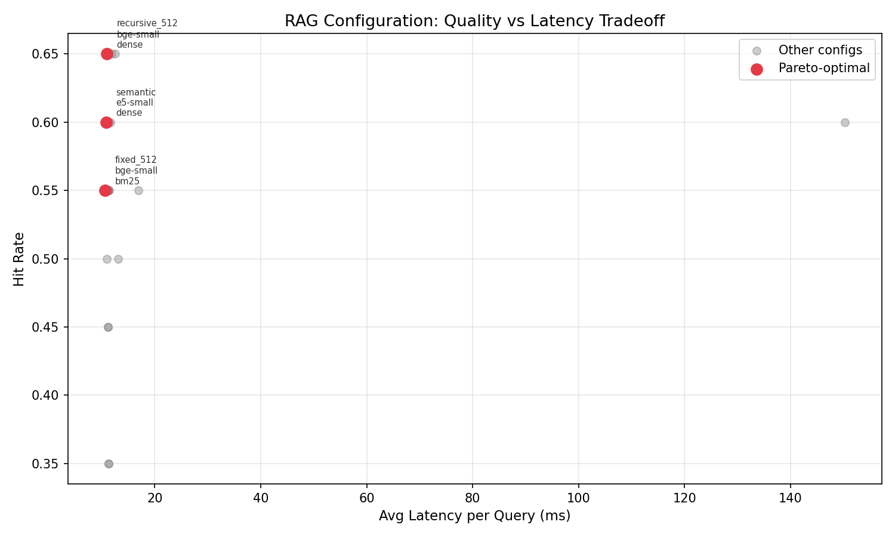

# RAG Forge

RAG Forge is a local benchmark runner and regression gate for comparing retrieval
pipeline choices: chunking strategy, embedding model, retrieval method, and optional
reranking.

The goal is simple: make RAG configuration changes measurable instead of guessing from a
few manual questions, then catch quality drops before a retrieval change ships.

## Sample Result

The included keyless smoke benchmark runs 24 retrieval configurations over a small
MLOps/RAG document set. In the latest local run, semantic-style chunking with local E5
embeddings and hybrid retrieval was the best default candidate for this corpus.

| Candidate | Hit Rate | MRR | Cached Query Latency |
|---|---:|---:|---:|
| `semantic|e5-small|hybrid|none` | 0.650 | 0.617 | 13ms |
| `fixed_512|e5-small|dense|none` | 0.650 | 0.600 | 70ms |
| `recursive_512|bge-small|dense|none` | 0.650 | 0.600 | 14ms |



The sample is intentionally small, so the numbers are a smoke-test artifact rather than
a universal benchmark. The full run details are in
[docs/sample-benchmark.md](docs/sample-benchmark.md), and the matching gate artifact is
in [docs/sample-regression-gate.md](docs/sample-regression-gate.md).
The engineering story and tradeoffs are written up in
[docs/case-study.md](docs/case-study.md).

## What It Does

Give RAG Forge a directory of `.txt` or `.md` documents and a CSV of question/answer
pairs. It builds a retrieval benchmark across combinations of:

- **Chunking:** fixed-size, recursive, and semantic-style paragraph grouping
- **Embeddings:** local BGE-small, local E5-small, and optional OpenAI embeddings
- **Retrieval:** dense, BM25, and hybrid retrieval
- **Reranking:** cross-encoder reranking or no reranker

For each configuration it records hit rate, MRR, context precision, chunk count, and
cached query latency, then writes Markdown and JSON reports plus an optional Pareto
plot.

The regression gate compares two `results.json` files and exits nonzero if the current
run exceeds the allowed hit-rate, MRR, or latency regression thresholds. It also warns
when the recommended configuration or benchmark grid changes.

## Quick Start

```bash
git clone https://github.com/GoparapukethaN/rag-forge.git
cd rag-forge

python -m venv .venv
. .venv/bin/activate
pip install -e ".[dev]"

rag-forge run --docs ./data/sample --qa ./data/sample/qa.csv --skip-openai --skip-reranker
```

The local embedding models download on first use. Use `--skip-openai --skip-reranker`
for the keyless smoke path shown in the sample report. Install `.[openai]` before using
OpenAI embeddings and `.[ragas]` before calling the optional RAGAS helper.

## CLI Reference

```bash
# run the included sample benchmark
rag-forge run --docs ./data/sample --qa ./data/sample/qa.csv --skip-openai --skip-reranker

# skip reranking for a faster run
rag-forge run --docs ./data/sample --qa ./data/sample/qa.csv \
  --skip-openai \
  --skip-reranker

# custom output directory and retrieval depth
rag-forge run --docs ./my_docs --qa ./my_qa.csv --output ./my_results --top-k 10

# compare a new benchmark run against a baseline
rag-forge gate \
  --baseline ./baseline/results.json \
  --current ./results/results.json \
  --output ./results/gate.json \
  --markdown ./results/gate.md
```

## QA File Format

The CSV needs `question` and `answer` columns:

```csv
question,answer
What is RAG?,Retrieval-Augmented Generation combines retrieval with generation
What metric checks ranking position?,MRR
```

The evaluation checks whether the retrieved chunks contain the expected answer text. This
makes the benchmark retrieval-focused; it does not score generated responses.

## Verification

```bash
python -m venv .venv
. .venv/bin/activate
pip install -e ".[dev]"
make verify
```

Last local verification (2026-05-20): `37 passed` and `ruff` clean.
Latest local verification details: [docs/verification.md](docs/verification.md).

For the included keyless sample benchmark:

```bash
PYTHON=.venv/bin/python ./scripts/run-sample-benchmark.sh /tmp/rag-forge-sample-smoke
```

Sample smoke result from 2026-05-20: 24 configurations tested, best hit rate `0.650`,
best MRR `0.617`, and both `results.md` and `results.json` generated. See
[docs/sample-benchmark.md](docs/sample-benchmark.md) for the exact command, scope, and
top configurations.

To rerun the sample benchmark and self-comparison gate together:

```bash
PYTHON=.venv/bin/python make sample-check
```

The sample regression gate below is a self-comparison smoke check. In normal use,
`--baseline` points to the last accepted `results.json` and `--current` points to the
new run:

```bash
rag-forge gate \
  --baseline /tmp/rag-forge-sample-smoke/results.json \
  --current /tmp/rag-forge-sample-smoke/results.json \
  --output docs/sample-regression-gate.json \
  --markdown docs/sample-regression-gate.md
```

Sample gate result from 2026-05-20: `pass`, with `0.02` maximum hit-rate drop, `0.02`
maximum MRR drop, and `25%` maximum latency increase. See
[docs/sample-regression-gate.md](docs/sample-regression-gate.md).

## How It Works

1. Load documents and QA pairs.
2. Chunk each document with every configured chunking strategy.
3. Embed chunks for each configured embedder.
4. Run dense, sparse, or hybrid retrieval for every question.
5. Optionally rerank the retrieved chunks.
6. Score retrieval against the expected answer text.
7. Rank configurations and generate Markdown/JSON reports.
8. Compare current and baseline reports with the regression gate.

Embedding work is cached within a benchmark run so retrieval methods and rerankers can
reuse the same chunk embeddings.

## Limitations

- Only `.txt` and `.md` files are supported.
- Local embedding models require a first-run model download.
- Evaluation is retrieval-only; generation quality is out of scope for this version.
- The sample dataset is intentionally small and should be treated as a smoke test, not a
  universal benchmark.
- Designed for English text.

## License

MIT. See [LICENSE](LICENSE).
